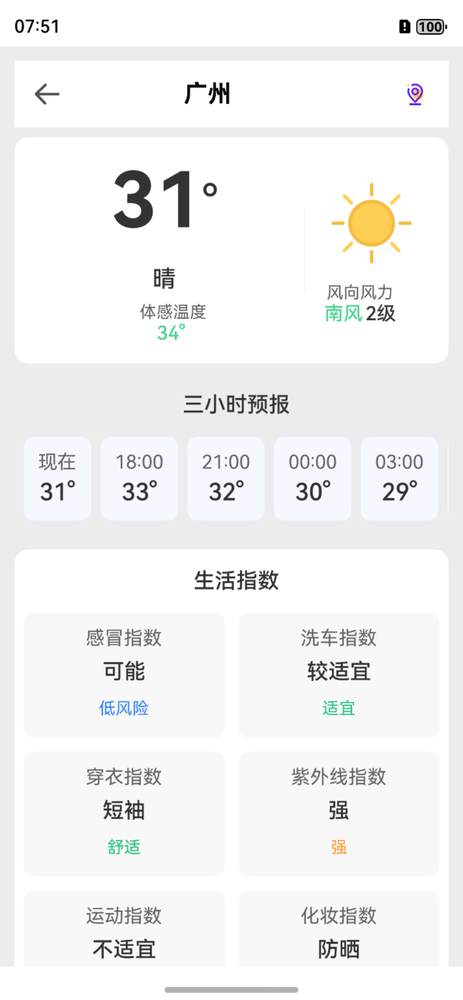
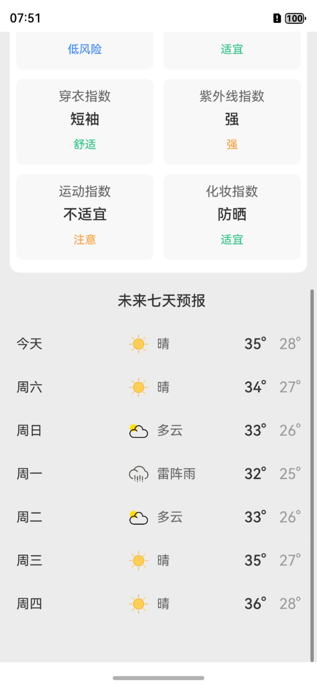

# 随心天气应用

这是一个基于HarmonyOS开发的天气应用，提供用户登录注册、城市选择、天气查询等功能。

## 功能展示（部分）
以下是应用各功能模块的界面展示：





## 功能特性

### 1. 用户管理
- 用户注册：支持新用户注册
- 用户登录：支持已注册用户登录
- 密码验证：登录时验证用户名和密码

### 2. 城市管理
- 城市列表：显示所有可用城市
- 城市搜索：支持按城市名称搜索
- 城市选择：用户可以选择查看特定城市的天气

### 3. 天气功能
- 当前天气：显示当前温度、体感温度、风向风力等
- 逐小时预报：显示未来几小时的天气预报
- 生活指数：显示感冒指数、洗车指数、穿衣指数等
- 每日预报：显示未来7天的天气预报

## 技术架构

### 前端 (HarmonyOS)
- **框架**: ArkTS + ArkUI
- **网络请求**: HTTP API
- **状态管理**: @State 装饰器
- **路由**: router API

### 后端 (Python)
- **框架**: Flask
- **数据库**: MySQL
- **ORM**: PyMySQL
- **API**: RESTful API

## 数据库设计

### 用户表 (users)
```sql
CREATE TABLE users (
    id INT AUTO_INCREMENT PRIMARY KEY,
    account VARCHAR(50) NOT NULL UNIQUE,
    password VARCHAR(100) NOT NULL,
    created_at TIMESTAMP DEFAULT CURRENT_TIMESTAMP,
    updated_at TIMESTAMP DEFAULT CURRENT_TIMESTAMP ON UPDATE CURRENT_TIMESTAMP
);
```

### 城市表 (cities)
```sql
CREATE TABLE cities (
    id INT AUTO_INCREMENT PRIMARY KEY,
    city_name VARCHAR(50) NOT NULL,
    weather VARCHAR(20) DEFAULT '晴',
    temperature VARCHAR(20) DEFAULT '20℃-30℃',
    value INT DEFAULT 0,
    created_at TIMESTAMP DEFAULT CURRENT_TIMESTAMP,
    updated_at TIMESTAMP DEFAULT CURRENT_TIMESTAMP ON UPDATE CURRENT_TIMESTAMP
);
```

## API接口

### 用户相关
- `POST /api/login` - 用户登录
- `POST /api/register` - 用户注册

### 城市相关
- `GET /api/cities` - 获取城市列表
- `POST /api/cities` - 添加新城市

### 天气相关
- `GET /api/weather/current` - 获取当前天气
- `GET /api/weather/hourly` - 获取逐小时预报
- `GET /api/weather/living-index` - 获取生活指数
- `GET /api/weather/daily` - 获取每日预报

## 安装和运行

### 后端设置
1. 安装Python依赖：
```bash
pip install flask pymysql
```

2. 创建数据库和表：
```sql
-- 创建数据库
CREATE DATABASE IF NOT EXISTS weather CHARACTER SET utf8 COLLATE utf8_general_ci;
USE weather;

-- 创建用户表
CREATE TABLE users (
    id INT AUTO_INCREMENT PRIMARY KEY,
    account VARCHAR(50) NOT NULL UNIQUE,
    password VARCHAR(100) NOT NULL,
    created_at TIMESTAMP DEFAULT CURRENT_TIMESTAMP,
    updated_at TIMESTAMP DEFAULT CURRENT_TIMESTAMP ON UPDATE CURRENT_TIMESTAMP
);

-- 创建城市表
CREATE TABLE cities (
    id INT AUTO_INCREMENT PRIMARY KEY,
    city_name VARCHAR(50) NOT NULL,
    weather VARCHAR(20) DEFAULT '晴',
    temperature VARCHAR(20) DEFAULT '20℃-30℃',
    value INT DEFAULT 0,
    created_at TIMESTAMP DEFAULT CURRENT_TIMESTAMP,
    updated_at TIMESTAMP DEFAULT CURRENT_TIMESTAMP ON UPDATE CURRENT_TIMESTAMP
);

-- 插入示例数据
INSERT INTO users (account, password) VALUES 
('admin', '123456'),
('test', '123456');

INSERT INTO cities (city_name, weather, temperature, value) VALUES 
('北京', '晴', '25℃-35℃', 100),
('上海', '多云', '28℃-38℃', 95),
('广州', '小雨', '30℃-40℃', 90),
('深圳', '晴', '29℃-39℃', 88),
('重庆', '阴', '26℃-36℃', 85),
('吐鲁番', '晴', '35℃-45℃', 92),
('苏州', '多云', '27℃-37℃', 87);
```

3. 启动后端服务：
```bash
python weatherapp.py
```

### 前端设置
1. 确保已安装DevEco Studio
2. 打开项目文件夹
3. 配置网络权限（如果需要）
4. 运行应用

## 项目结构

```
Helper2/
├── Helper/
│   ├── entry/
│   │   └── src/
│   │       └── main/
│   │           └── ets/
│   │               ├── pages/           # 页面文件
│   │               │   ├── Index.ets           # 启动页
│   │               │   ├── WeatherLogin.ets    # 登录页
│   │               │   ├── HelperZhuCePage.ets # 注册页
│   │               │   ├── Weather2Page.ets    # 城市选择页
│   │               │   └── WeatherYuBaoPage.ets # 天气详情页
│   │               └── utils/           # 工具类
│   │                   ├── HttpUtils.ets       # HTTP工具类
│   │                   └── ApiService.ets      # API服务类
│   └── AppScope/
└── weatherapp.py    # 后端Python文件
```

## 注意事项

1. **网络配置**: 确保前端能够访问后端API地址
2. **数据库连接**: 确保MySQL服务正在运行
3. **端口配置**: 后端默认运行在5000端口
4. **跨域问题**: 如果遇到跨域问题，需要在后端添加CORS支持

## 开发说明

### 添加新功能
1. 在后端添加新的API接口
2. 在前端ApiService中添加对应的方法
3. 在页面中调用API方法
4. 更新UI界面

### 调试技巧
1. 使用console.log()输出调试信息
2. 检查网络请求是否成功
3. 验证数据库连接是否正常
4. 查看浏览器开发者工具的网络面板

## 许可证

本项目仅供学习和演示使用。
